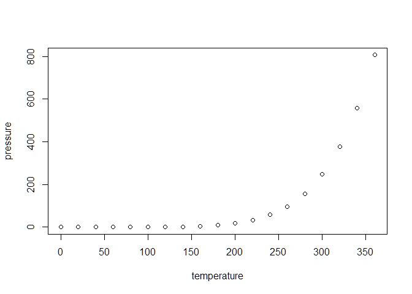

Trump Tweet Habit Analysis
================
Wenlong Yang
11/3/2019

## Introduction

In this report, I analyzed the tweeting habit of Donald Trump and what
we can learn about the president from these tweets.

The data was downloaded from a
[website](http://http://www.trumptwitterarchive.com/data/realdonaldtrump/)
created by Brendan Brown. I extracted all of Trump’s tweets from 2009 to
Nov. 3rd 2019 as the total data. The size of the data is about 9 Mb.

## The devices

First of all, let us take a look at the devices Trump use to send
tweets. We will look at the statistics for the whole time between 2009
to 2019.

<!-- -->

Now, let us check the number of tweets by year.

<!-- -->

## Including Plots

You can also embed plots, for example:

<!-- -->

Note that the `echo = FALSE` parameter was added to the code chunk to
prevent printing of the R code that generated the plot.
